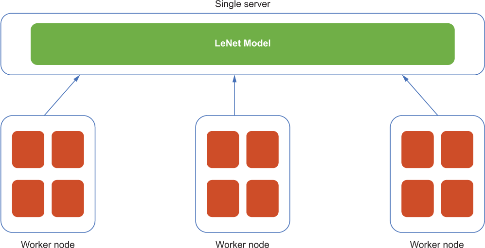

# 《分布式机器学习模式》

## 第二章 数据摄取模式
监控任何传入数据并执行必要的预处理步骤来准备模型训练
- 批处理模式：批处理模式通过小批量使用数据集来帮助处理内存中的大型数据集。
- 分片模式：分片模式将非常大的数据集准备为位于不同计算机上的较小数据块。
- 缓存模式：缓存模式通过缓存以前访问的数据，使多轮训练的数据获取更加高效，这些数据可以重复用于同一数据集上的其他轮次模型训练。

## 第三章 分布式训练模式
### 模式
- 参数服务器模式：解决模型（参数）太大无法在单个机器上训练的问题，分区并存储在多个参数服务器上。
- 集合通信模式：当参数服务器时通信开销过多时，使用集体通信模式worker之间进行环形循环进行通信，适合中小型模型。

具有单个参数服务器的机器学习训练

具有多个参数服务器的机器学习训练\
由于所有工作线程都以异步方式执行计算，因此每个工作线程节点用于计算梯度的模型分区可能不是最新的。为了保证每个 Worker 节点使用的模型分区或服务器存储的每个参数分区都是最新的，我们必须不断在 Worker 节点之间拉取和推送模型的更新。
尽管 parameter server 模式在此方案中很有用，但它是专门为训练具有大量参数的模型而设计的。

仅包含Worker节点的分布式模型训练组件。每个工作程序都存储了整个模型参数集的副本，并使用数据分区来计算梯度。

以sum作为reduce函数的reduce操作示例

向进程组中的每个进程发送值的广播作示例
reduce和broadcast操作的组合称为allreduce，它根据指定的reduce函数减少结果，然后将减少的结果分发到所有进程；
当我们完成一轮allreduce操作后，我们开始下一轮训练，方法是将新数据提供给更新的模型，计算梯度。

一个 allreduce操作示例，该操作减少组中每个进程的结果，然后将结果发送到组中的每个进程；
ring-allreduce 算法。该过程类似于 allreduce 作，但数据以类似环的方式传输，没有 reduce 作。
每个 N worker只需与其两个peer worker 通信 2*（N - 1） 次，即可完全更新所有模型参数。

## 第四章

### 模式服务模式
**模型服务是加载以前训练的机器学习模型、生成预测或对新输入数据进行推理的过程。**
- 复制服务模式
- 分片服务模式
- 事件驱动的处理模式

通过向系统添加模型服务器副本来扩展模型服务器后的系统架构(复制模式，水平扩展)\
复制服务有助于处理不断增长的模型服务请求，并在复制服务的帮助下实现水平扩展。

分片服务模式的示例架构，其中高分辨率视频被分成两个单独的视频。每个视频代表原始大请求的一个子集，由不同的模型服务器分片独立处理。\
分片服务模式允许系统处理大型请求，并有效地将处理大型模型服务请求的工作负载分配给多个模型服务器分片。

用于预测酒店价格的事件驱动模型服务系统图\
通过事件驱动的处理模式，我们可以确保我们的系统只使用处理每个请求所需的资源，而无需担心资源利用率和空闲。

